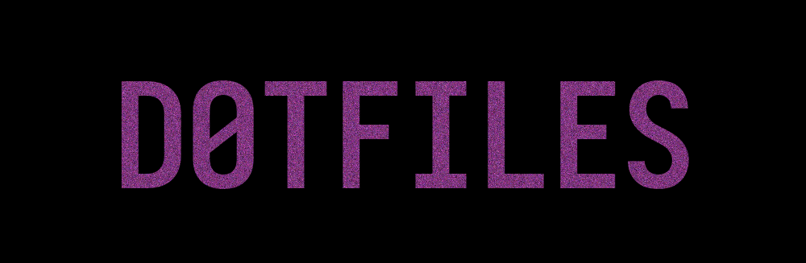
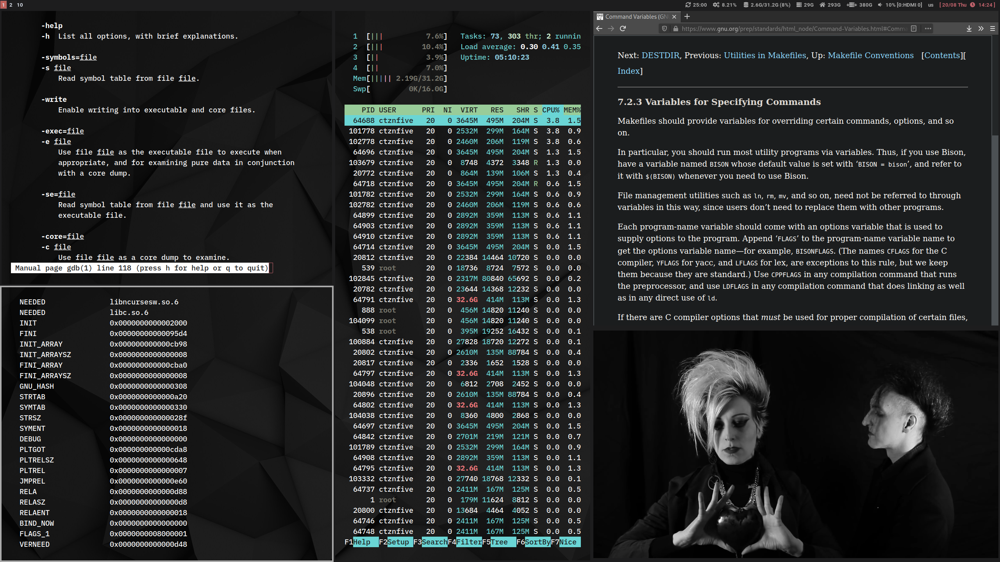
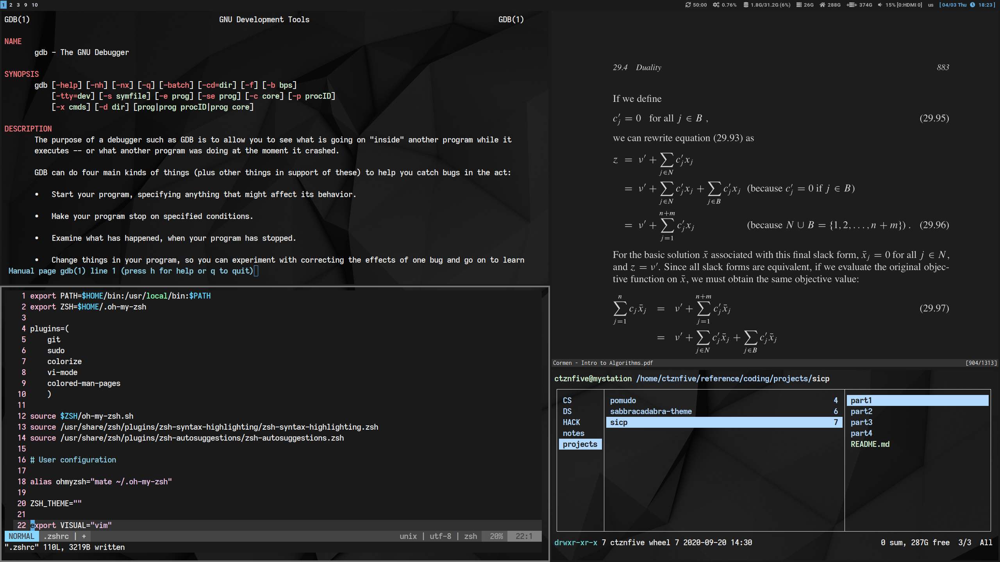

| System      | Repository Branch                                                      |
|-------------|------------------------------------------------------------------------|
| Arch        | [arch](https://github.com/ctznfive/ctznfive-dotfiles/tree/arch)        |
| Debian      | [debian](https://github.com/ctznfive/ctznfive-dotfiles/tree/debian)    |

---

# Specification
 Category                  | Tools                                                                                                      |
| ------------------------ | ---------------------------------------------------------------------------------------------------------------------- |
| **Window Manager**       | i3																						|
| **Status Bar**           | i3blocks																						|
| **Shell**                | zsh + oh my zsh                                                                                                        |
| **Terminal Emulator**    | rxvt-unicode                                                              				|
| **Terminal Multiplexer** | tmux                                                              				|
| **Launcher**             | rofi / dmenu                                                                           |
| **Text Editor**          | emacs / vim                                                                                                      |
| **File Manager**		       | zsh + fzf / dired / ranger                                                                                          |
| **Image Viewer**         | feh                                                                 |    
| **Music & Video Player** | mpv                                                                                                   |
| **Screenshot App**       | scrot                                                    |
| **System Monitor**       | htop                                                                                                                   |
| **Notifications**         | dunst                    										                             |
| **Mail Client**          | mutt                    										                             |
| **PDF Viewer**           | zathura                    										                             |
| **Web Browser**          | firefox / eww                 										                             |
| **Office Suite**           | libreoffice                     										                             |
| **Brainstorming**        | orgmode / libreoffice draw                    										                             |
| **Backup Solution**      | rsync + borg                    										                             |
| **GTD, PIM & Notes**   | orgmode                    										                             |
| **Hosted Hypervisor**   | virtualbox / qemu  |
| **Password Manager**   | pass / orgmode  |
| **File Synchronization**   | git-annex  |

---

# Screenshots

